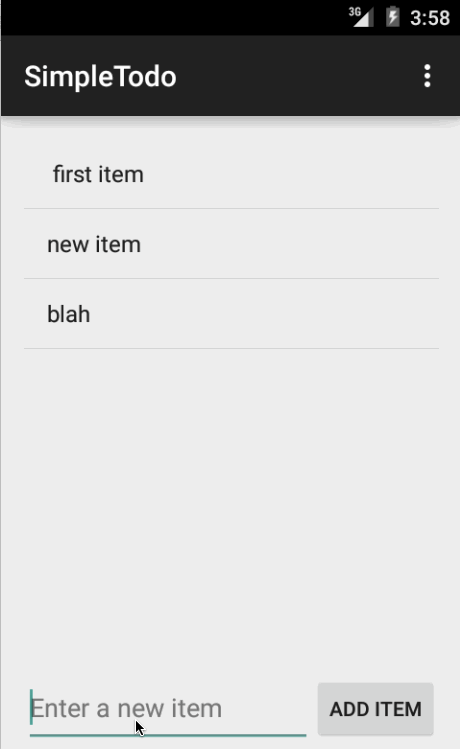

#Simple Todo Demo

This is the basic todo app.

Time spent: 5 hours total

Completed user stories:

- [x] Required: Can you successfully add and remove items from the todo list within your app?
- [x] Required: Did you include support for editing todo items as described above?
- [x] Required: Does your app persist todo items and retrieve them properly on app restart?

Notes: Built first android app!

Walkthrough of all user stories

